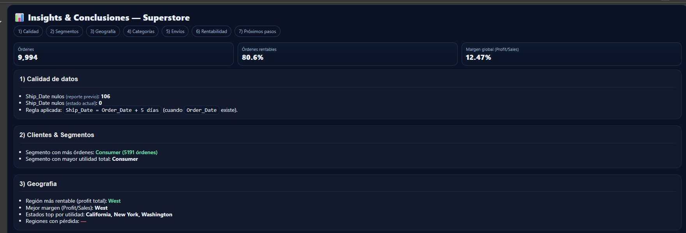
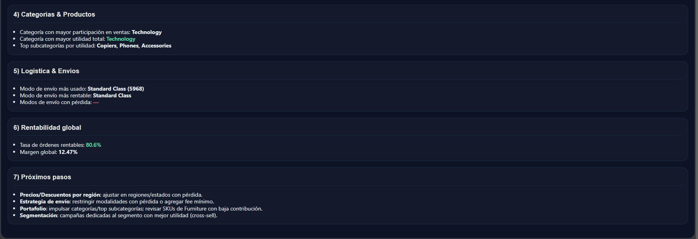

# Superstore — EDA + Insights en Colab

Un proyecto sencillo y presentable para explorar el dataset **Sample – Superstore**, generar **insights** claros (segmentos, regiones, categorías, envíos, rentabilidad) y mostrar un **informe bonito** dentro del notebook (con bookmarks y KPIs).

---

## 🧠 ¿Qué hace este proyecto?

- **Integra GitHub con Google Colab** para que cualquiera pueda abrir y correr el notebook desde el navegador.
- **Carga el Excel desde Google Drive** (ruta flexible para evitar errores de espacios en el nombre).
- Realiza un **Análisis Exploratorio de Datos (EDA)**:
  - Tipifica columnas, normaliza nombres y **cuenta vacíos** por columna.
  - Reporta **duplicados** y estadísticos generales.
  - Muestra **distribuciones**, **correlaciones** y **posibles outliers**.
- **Imputa Ship_Date** como **Order_Date + 5 días** (sin perder el reporte de nulos original para auditar el cambio).
- **Genera un informe con estilo** (HTML/Markdown) que resume hallazgos:
  - Segmento con más órdenes y segmento más rentable.
  - Regiones/estados con mejor/peor desempeño.
  - Categorías y subcategorías top.
  - Modos de envío más usados y con mejor utilidad.
  - % de órdenes rentables y margen global.
- Exporta **archivos** útiles:
  - `eda_outputs/missing_report.csv` (reporte de nulos)
  - `eda_outputs/describe_all.csv` (descriptivos)
  - `eda_outputs/superstore_sample_clean.csv` (muestra limpia)

> Screenshots de Insights y Conclusiones
> 
> 
> 
> 

